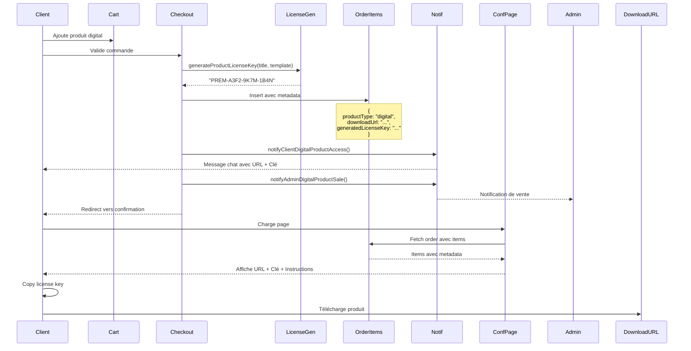

# Process de Commande de Produits Numériques

## 📋 Vue d'Ensemble

Ce document décrit le processus complet de commande pour les produits numériques (type: `digital`), incluant la livraison par URL de téléchargement, clé de licence, ou les deux.

### Types de Livraison Digitale

Le système supporte **3 modes de livraison** pour les produits numériques :

| Type | Champ `digitalDeliveryType` | Description |
|------|---------------------------|-------------|
| **URL seulement** | `url` | Le client reçoit uniquement un lien de téléchargement |
| **Clé de licence seulement** | `license` | Le client reçoit une clé d'activation (générée ou personnalisée) |
| **URL + Clé** | `both` | Le client reçoit les deux (téléchargement + licence) |

---

## 🔑 Fonctionnalités Implémentées

### 1. **Génération Automatique de Clés de Licence**

**Fichier:** [lib/license-key-generator.ts](vscode-vfs://github+7b2276223a312c22726566223a7b2274797065223a342c226964223a22636c617564652f6669782d63616c656e6461722d636c69636b2d6572726f72732d734e6a6a76227d7d/neosaastech/neosaas-website/lib/license-key-generator.ts)

#### Fonctions disponibles :

| Fonction | Description | Exemple de sortie |
|----------|-------------|-------------------|
| `generateLicenseKey()` | Génère une clé standard avec 4 segments | `A3F2-9K7M-1B4N-P5Q8` |
| `generateLicenseKeyFromTemplate(template)` | Utilise un template personnalisé | `"PROD-XXXX"` → `"PROD-A3F2"` |
| `generateProductLicenseKey(title, template)` | Génère avec préfixe du produit | `"Adobe App"` → `"ADOB-A3F2-9K7M-1B4N"` |
| `generateActivationCode(length)` | Code court pour produits simples | `ABC123XY` |
| `validateLicenseKey(key)` | Valide le format d'une clé | `true/false` |

#### Algorithme de génération :

```typescript
// Si un template est défini dans le produit
if (product.licenseKey) {
  // Utilise le template (ex: "PROD-XXXX-XXXX" → "PROD-A3F2-9K7M")
  return generateLicenseKeyFromTemplate(product.licenseKey)
}

// Sinon, génère avec préfixe du titre du produit
const prefix = productTitle.substring(0, 4).toUpperCase() // "Adobe App" → "ADOB"
return `${prefix}-${randomSegments()}` // "ADOB-A3F2-9K7M-1B4N"
```

**Exemple de clés générées :**

| Titre Produit | Template Produit | Clé Générée |
|---------------|------------------|-------------|
| Adobe Photoshop | `PHOT-XXXX-XXXX-XXXX` | `PHOT-A3F2-9K7M-1B4N` |
| Premium Plugin | `null` | `PREM-T8K3-L9M2-P5Q1` |
| eBook Bundle | `BOOK-XXX-XXX` | `BOOK-A3F-9K7` |

---

### 2. **Stockage des Clés dans OrderItems**

Lors du checkout, chaque produit digital génère une clé de licence unique qui est stockée dans le champ `metadata` de l'`orderItem`.

**Fichier:** [app/actions/ecommerce.ts](vscode-vfs://github+7b2276223a312c22726566223a7b2274797065223a342c226964223a22636c617564652f6669782d63616c656e6461722d636c69636b2d6572726f72732d734e6a6a76227d7d/neosaastech/neosaas-website/app/actions/ecommerce.ts) - fonction `processCheckout()`

```typescript
// Génération de clé pour produit digital
if (item.product.type === 'digital') {
  const generatedLicenseKey = generateProductLicenseKey(
    item.product.title,
    item.product.licenseKey  // Template optionnel
  )
  
  itemMetadata = {
    productType: 'digital',
    downloadUrl: item.product.fileUrl || item.product.downloadUrl,
    generatedLicenseKey,
    licenseInstructions: item.product.licenseInstructions
  }
}

// Insertion dans orderItems
await db.insert(orderItems).values({
  orderId: order.id,
  itemType: "product",
  itemId: item.product.id,
  itemName: item.product.title,
  quantity: item.quantity,
  unitPrice: item.product.price,
  totalPrice: item.product.price * item.quantity,
  metadata: itemMetadata  // ⭐ Contient la clé générée
})
```

**Structure du metadata pour un produit digital :**

```json
{
  "productType": "digital",
  "downloadUrl": "https://storage.example.com/product.zip",
  "generatedLicenseKey": "PREM-A3F2-9K7M-1B4N",
  "licenseInstructions": "Entrez cette clé dans Paramètres > Licence de l'application"
}
```

---

### 3. **Notifications Client - Accès aux Produits Digitaux**

**Fichier:** [lib/notifications/admin-notifications.ts](vscode-vfs://github+7b2276223a312c22726566223a7b2274797065223a342c226964223a22636c617564652f6669782d63616c656e6461722d636c69636b2d6572726f72732d734e6a6a76227d7d/neosaastech/neosaas-website/lib/notifications/admin-notifications.ts)

#### Fonction : `notifyClientDigitalProductAccess()`

Envoie une notification au client via le système de chat avec :
- 🔗 **URL de téléchargement**
- 🔑 **Clé de licence générée**
- 📝 **Instructions d'activation** (si disponibles)

**Message envoyé au client :**

```
🎉 Your digital products are ready!

Order: ORD-2024-001234

📦 **Premium Plugin**

**Download Link:** https://storage.example.com/plugin.zip

**License Key:** `PREM-A3F2-9K7M-1B4N`

**Activation Instructions:**
1. Download and install the plugin
2. Go to Settings > License
3. Enter your license key
4. Click "Activate"

---

Thank you for your purchase! Your digital products are now available for instant access.

View your order details: [dashboard](/dashboard/checkout/confirmation?orderId=xxx)
```

---

### 4. **Notifications Admin - Vente de Produits Digitaux**

**Fichier:** [lib/notifications/admin-notifications.ts](vscode-vfs://github+7b2276223a312c22726566223a7b2274797065223a342c226964223a22636c617564652f6669782d63616c656e6461722d636c69636b2d6572726f72732d734e6a6a76227d7d/neosaastech/neosaas-website/lib/notifications/admin-notifications.ts)

#### Fonction : `notifyAdminDigitalProductSale()`

Envoie une notification à l'admin pour le suivi des ventes :
- 💻 **Type de vente** : Digital
- 📊 **Montant total**
- 📦 **Liste des produits**
- ✅ **Confirmation automatique** de génération de clés

**Message envoyé à l'admin :**

```
💻 New digital product sale!

**Order:** ORD-2024-001234
**Customer:** John Doe (john@example.com)
**Total:** 49.00 EUR

**Digital products:**
• Premium Plugin (x1)
• eBook Bundle (x1)

✅ License keys generated and sent to customer automatically.

Manage order: [admin dashboard](/admin/orders/xxx)
```

---

## 🎨 Page de Confirmation - Affichage des Produits Digitaux

**Fichier:** [app/(private)/dashboard/checkout/confirmation/page.tsx](vscode-vfs://github+7b2276223a312c22726566223a7b2274797065223a342c226964223a22636c617564652f6669782d63616c656e6461722d636c69636b2d6572726f72732d734e6a6a76227d7d/neosaastech/neosaas-website/app/(private)/dashboard/checkout/confirmation/page.tsx)

### Fonctionnalités ajoutées :

1. **Section dédiée aux produits digitaux**
   - Filtre automatique des items avec `metadata.productType === 'digital'`
   - Design distinct avec gradient violet/bleu

2. **Affichage du lien de téléchargement**
   - Bouton cliquable avec icône `ExternalLink`
   - Ouverture dans un nouvel onglet
   - Style hover avec transition

3. **Clé de licence avec copie**
   - Affichage en police monospace
   - Bouton "Copy" pour copier dans le presse-papier
   - Feedback visuel "Copied!" avec icône verte

4. **Instructions d'activation**
   - Texte pré-formaté (whitespace-pre-wrap)
   - Border et background pour mise en évidence

### Aperçu Visuel :

```
┌────────────────────────────────────────────────────────────┐
│  🎉 Your Digital Products                                   │
├────────────────────────────────────────────────────────────┤
│  📦 Premium Plugin                 [Ready]                  │
│  Digital Product • Instant Access                          │
│                                                            │
│  📥 Download Link                                          │
│  [🔗 Download Premium Plugin] ───────────────────────►     │
│                                                            │
│  🔑 License Key                                            │
│  ┌──────────────────────────────────┐  [📋 Copy]          │
│  │ PREM-A3F2-9K7M-1B4N              │                      │
│  └──────────────────────────────────┘                      │
│                                                            │
│  📝 Activation Instructions                                │
│  ┌─────────────────────────────────────────────────────┐  │
│  │ 1. Download and install the plugin                  │  │
│  │ 2. Go to Settings > License                         │  │
│  │ 3. Enter your license key                           │  │
│  │ 4. Click "Activate"                                 │  │
│  └─────────────────────────────────────────────────────┘  │
└────────────────────────────────────────────────────────────┘
```

---

## 🔄 Flux Complet du Processus

### Diagramme de Séquence :



---

## 📊 Données en Base de Données

### Table `products`

| Champ | Type | Description | Exemple |
|-------|------|-------------|---------|
| `type` | `text` | Type de produit | `'digital'` |
| `fileUrl` | `text` | URL de téléchargement | `https://storage...` |
| `downloadUrl` | `text` | Lien direct alternatif | `https://cdn...` |
| `licenseKey` | `text` | **Template** de clé | `"PROD-XXXX-XXXX"` |
| `licenseInstructions` | `text` | Instructions d'activation | `"Allez dans Paramètres..."` |

### Table `order_items`

| Champ | Type | Description | Contenu pour Digital |
|-------|------|-------------|----------------------|
| `orderId` | `uuid` | ID de la commande | `uuid` |
| `itemName` | `varchar` | Nom du produit | `"Premium Plugin"` |
| `quantity` | `integer` | Quantité | `1` |
| `unitPrice` | `integer` | Prix unitaire (centimes) | `4900` |
| `totalPrice` | `integer` | Prix total (centimes) | `4900` |
| `metadata` | `jsonb` | **Données digitales** | Voir ci-dessous ⬇️ |

#### Structure du `metadata` pour produit digital :

```json
{
  "productType": "digital",
  "downloadUrl": "https://storage.example.com/product.zip",
  "generatedLicenseKey": "PREM-A3F2-9K7M-1B4N",
  "licenseInstructions": "1. Download\n2. Go to Settings > License\n3. Enter key\n4. Activate"
}
```

---

## ⚙️ Configuration Admin - Formulaire Produit Digital

**Fichier:** `app/(private)/admin/products/product-form.tsx`

### Accès au Formulaire

1. Aller dans **Admin > Products**
2. Cliquer sur **New Product** ou éditer un produit existant
3. Sélectionner **Digital** dans le dropdown "Product Type"

### Champs Disponibles

Lorsque le type "Digital" est sélectionné, une section bleue apparaît avec :

#### 0. Type de Livraison (NOUVEAU)

**Dropdown de sélection :**
- 🔗 **URL seulement** : Le client reçoit uniquement un lien de téléchargement
- 🔑 **Clé de licence seulement** : Le client reçoit une clé d'activation
- 📦 **URL + Clé** : Le client reçoit les deux

> **Important :** Les champs suivants s'affichent selon le type de livraison sélectionné.

#### 1. Download URL (si type = `url` ou `both`)
```
Label: Download URL
Placeholder: https://storage.example.com/file.zip
Description: Direct download link for the digital product
```

**Usage:**
- URL vers le fichier à télécharger (S3, Google Drive, Dropbox, etc.)
- Sera affiché au client après achat

#### 2. License Key (si type = `license` ou `both`)

**Toggle Auto-génération:**
- ✅ **ON (par défaut)** : Génère automatiquement une clé format `XXXX-XXXX-XXXX-XXXX` pour chaque achat
- ❌ **OFF** : Permet d'entrer une clé personnalisée ou un template

**Mode Personnalisé:**
```
Label: Custom License Key / Template
Placeholder: PROD-XXXX-XXXX-XXXX or your-custom-key
Description: Enter a fixed key or use XXXX as placeholders for random characters
```

**Exemples de configuration:**

| Configuration | Résultat |
|---------------|----------|
| Auto-génération ON | `7K3M-P2Q5-L8N1-R4S9` (unique par achat) |
| Template `ADOBE-XXXX-XXXX` | `ADOBE-7K3M-P2Q5` |
| Clé fixe `PROMO-2024-SPECIAL` | `PROMO-2024-SPECIAL` (même pour tous) |

#### 3. Activation Instructions
```
Label: Activation Instructions (Optional)
Placeholder: 1. Go to Settings > License
             2. Enter your license key
             3. Click Activate
```

**Usage:**
- Instructions multi-lignes pour expliquer au client comment activer le produit
- Affiché dans la confirmation de commande et les emails

### Capture d'écran du Formulaire

```
┌─────────────────────────────────────────────────────────┐
│ 💻 Digital Product Configuration                        │
├─────────────────────────────────────────────────────────┤
│ ┌─────────────────────────────────────────────────────┐ │
│ │ 📥 Download URL                                     │ │
│ │ [https://example.com/product.zip              ]    │ │
│ │ Direct download link (cloud storage URL)           │ │
│ └─────────────────────────────────────────────────────┘ │
│                                                         │
│ ┌─────────────────────────────────────────────────────┐ │
│ │ 🔑 License Key                                      │ │
│ │ [✓] Auto-generate license key for each purchase    │ │
│ │                                                     │ │
│ │ ┌───────────────────────────────────────────┐      │ │
│ │ │ ✅ Automatic license generation enabled   │      │ │
│ │ │ Format: XXXX-XXXX-XXXX-XXXX              │      │ │
│ │ └───────────────────────────────────────────┘      │ │
│ └─────────────────────────────────────────────────────┘ │
│                                                         │
│ ┌─────────────────────────────────────────────────────┐ │
│ │ 📝 Activation Instructions (Optional)               │ │
│ │ ┌───────────────────────────────────────────────┐  │ │
│ │ │ 1. Download and install                       │  │ │
│ │ │ 2. Go to Settings > License                   │  │ │
│ │ │ 3. Enter your license key                     │  │ │
│ │ │ 4. Click Activate                             │  │ │
│ │ └───────────────────────────────────────────────┘  │ │
│ └─────────────────────────────────────────────────────┘ │
└─────────────────────────────────────────────────────────┘
```

---

## 🧪 Tests Recommandés

### Test 1 : Commande Produit Digital

1. ✅ Créer un produit avec `type: 'digital'`
2. ✅ Définir `fileUrl` et optionnel `licenseKey` template
3. ✅ Ajouter au panier et valider
4. ✅ Vérifier génération de clé unique
5. ✅ Vérifier notification client avec URL + clé
6. ✅ Vérifier notification admin

### Test 2 : Page de Confirmation

1. ✅ Accéder à `/dashboard/checkout/confirmation?orderId=xxx`
2. ✅ Vérifier section "Your Digital Products" affichée
3. ✅ Vérifier bouton "Download" fonctionnel
4. ✅ Tester copie de clé de licence
5. ✅ Vérifier affichage des instructions

### Test 3 : Templates de Clés

| Template Produit | Titre | Résultat Attendu |
|------------------|-------|------------------|
| `PROD-XXXX-XXXX-XXXX` | Adobe App | `PROD-A3F2-9K7M-1B4N` |
| `null` | Premium Plugin | `PREM-T8K3-L9M2-P5Q1` |
| `APP-XXX-XXX` | Mobile App | `APP-A3F-9K7` |

---

## 🗄️ Migration Base de Données

### Colonne `digital_delivery_type`

Cette fonctionnalité nécessite la colonne `digital_delivery_type` dans la table `products`.

**Fichier de migration :** `drizzle/0003_add_digital_delivery_type.sql`

```sql
ALTER TABLE "products" ADD COLUMN IF NOT EXISTS "digital_delivery_type" text DEFAULT 'license';

-- Met à jour les produits existants
UPDATE "products"
SET "digital_delivery_type" = CASE
    WHEN "file_url" IS NOT NULL AND "file_url" != ''
         AND ("license_key" IS NOT NULL OR "license_instructions" IS NOT NULL)
         THEN 'both'
    WHEN "file_url" IS NOT NULL AND "file_url" != '' THEN 'url'
    ELSE 'license'
END
WHERE "type" = 'digital';
```

### Application de la migration

**Option 1 - Synchronisation automatique (Vercel) :**
```bash
# Le script de build exécute automatiquement pnpm db:push
git push origin main  # ou votre branche
# Vercel déploie et synchronise le schéma
```

**Option 2 - Synchronisation manuelle (Local) :**
```bash
pnpm db:push
```

**Option 3 - Migration SQL directe :**
```bash
psql -d votre_base -f drizzle/0003_add_digital_delivery_type.sql
```

### Vérification

Après la migration, vérifiez que la colonne existe :
```sql
SELECT column_name, data_type, column_default
FROM information_schema.columns
WHERE table_name = 'products' AND column_name = 'digital_delivery_type';
```

---

## 📝 Checklist de Déploiement

- [x] ✅ Fonction de génération de clés implémentée
- [x] ✅ Stockage dans `orderItems.metadata`
- [x] ✅ Notification client avec URL et clé
- [x] ✅ Notification admin pour suivi
- [x] ✅ Page de confirmation avec section digitale
- [x] ✅ Fonction copie de clé
- [x] ✅ Instructions d'activation affichées
- [x] ✅ Colonne `digital_delivery_type` dans le schéma
- [x] ✅ Migration SQL créée
- [ ] ⏳ **IMPORTANT : Exécuter la migration** (`pnpm db:push` ou migration SQL)
- [ ] ⏳ Tests end-to-end avec vrais produits
- [ ] ⏳ Validation des URLs de téléchargement
- [ ] ⏳ Configuration des templates de clés

---

## 🔗 Fichiers Modifiés/Créés

| Fichier | Statut | Description |
|---------|--------|-------------|
| [lib/license-key-generator.ts](vscode-vfs://github+7b2276223a312c22726566223a7b2274797065223a342c226964223a22636c617564652f6669782d63616c656e6461722d636c69636b2d6572726f72732d734e6a6a76227d7d/neosaastech/neosaas-website/lib/license-key-generator.ts) | ✅ Créé | Générateur de clés de licence |
| [lib/notifications/admin-notifications.ts](vscode-vfs://github+7b2276223a312c22726566223a7b2274797065223a342c226964223a22636c617564652f6669782d63616c656e6461722d636c69636b2d6572726f72732d734e6a6a76227d7d/neosaastech/neosaas-website/lib/notifications/admin-notifications.ts) | ✅ Modifié | +2 fonctions notification |
| [lib/notifications/index.ts](vscode-vfs://github+7b2276223a312c22726566223a7b2274797065223a342c226964223a22636c617564652f6669782d63616c656e6461722d636c69636b2d6572726f72732d734e6a6a76227d7d/neosaastech/neosaas-website/lib/notifications/index.ts) | ✅ Modifié | Exports ajoutés |
| [app/actions/ecommerce.ts](vscode-vfs://github+7b2276223a312c22726566223a7b2274797065223a342c226964223a22636c617564652f6669782d63616c656e6461722d636c69636b2d6572726f72732d734e6a6a76227d7d/neosaastech/neosaas-website/app/actions/ecommerce.ts) | ✅ Modifié | Génération clé + notifications |
| [app/(private)/dashboard/checkout/confirmation/page.tsx](vscode-vfs://github+7b2276223a312c22726566223a7b2274797065223a342c226964223a22636c617564652f6669782d63616c656e6461722d636c69636b2d6572726f72732d734e6a6a76227d7d/neosaastech/neosaas-website/app/(private)/dashboard/checkout/confirmation/page.tsx) | ✅ Modifié | Section produits digitaux |

---

## 🎯 Avantages du Système

1. **Automatisation Complète**
   - Génération automatique de clés uniques
   - Aucune intervention manuelle requise

2. **Expérience Client Optimale**
   - Accès instantané aux produits
   - Clé copiable en un clic
   - Instructions claires

3. **Traçabilité Admin**
   - Notification immédiate des ventes
   - Suivi via système de chat
   - Possibilité d'engager conversation

4. **Sécurité**
   - Clés uniques par commande
   - Stockage sécurisé dans metadata
   - Validation de format

5. **Flexibilité**
   - Templates personnalisables
   - Instructions d'activation par produit
   - Support de multiples URLs

---

**Date:** 8 janvier 2026  
**Auteur:** Claude (Assistant IA)  
**Statut:** ✅ Implémenté - Prêt pour tests
