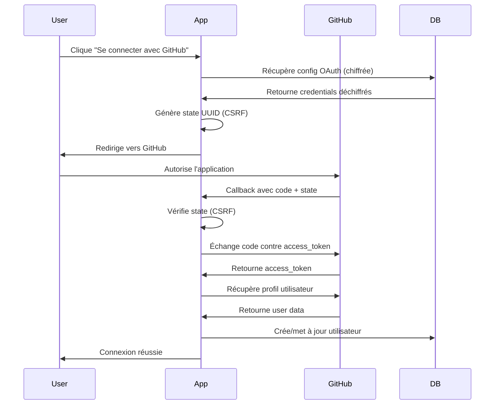

# GitHub OAuth - Index de Documentation

**Mise à jour** : 2026-01-23

Ce document sert d'index pour toute la documentation GitHub OAuth du projet NeoSaaS.

---

## 🚨 Dépannage et Corrections

### Problèmes de Redirect URI

| Document | Usage |
|----------|-------|
| [**GITHUB_OAUTH_FIX_REDIRECT_URI.md**](./GITHUB_OAUTH_FIX_REDIRECT_URI.md) | ⚡ **ACTION IMMÉDIATE** - Correction rapide (5 min) pour l'erreur "redirect_uri not associated" |
| [**GITHUB_OAUTH_REDIRECT_URI_TROUBLESHOOTING.md**](./GITHUB_OAUTH_REDIRECT_URI_TROUBLESHOOTING.md) | 🔍 **GUIDE COMPLET** - Diagnostic approfondi et solutions détaillées |

**Quand utiliser :**
- Vous recevez l'erreur "The redirect_uri is not associated with this application"
- GitHub refuse votre callback URL
- Problèmes de redirection après authentification

---

## 📚 Documentation Principale

### Configuration et Setup

| Document | Description |
|----------|-------------|
| [GITHUB_OAUTH_QUICKSTART.md](./GITHUB_OAUTH_QUICKSTART.md) | 🚀 Démarrage rapide - Configuration en 5 étapes |
| [GITHUB_OAUTH_MANUAL_SETUP.md](./GITHUB_OAUTH_MANUAL_SETUP.md) | 📖 Guide de configuration manuel complet |
| [GITHUB_OAUTH_AUTO_CONFIG.md](./GITHUB_OAUTH_AUTO_CONFIG.md) | 🤖 Configuration automatique avec scripts |
| [GITHUB_OAUTH_SETUP_SUMMARY.md](./GITHUB_OAUTH_SETUP_SUMMARY.md) | 📋 Résumé des étapes de configuration |

### Architecture et Intégration

| Document | Description |
|----------|-------------|
| [GITHUB_OAUTH_INTEGRATION.md](./GITHUB_OAUTH_INTEGRATION.md) | 🏗️ Intégration dans l'application |
| [OAUTH_DATABASE_CONFIG.md](./OAUTH_DATABASE_CONFIG.md) | 💾 Configuration en base de données (pas ENV) |
| [OAUTH_NO_ENV_IMPLEMENTATION.md](./OAUTH_NO_ENV_IMPLEMENTATION.md) | 🔧 Architecture sans variables d'environnement |

### Documentation Technique

| Document | Description |
|----------|-------------|
| [GITHUB_API_INTEGRATION.md](./GITHUB_API_INTEGRATION.md) | 🔌 API GitHub pour monitoring serveur |
| [OAUTH_SOCIAL_AUTH.md](./OAUTH_SOCIAL_AUTH.md) | 👥 OAuth pour autres providers (Google, etc.) |

---

## 🔐 Sécurité et Audit

| Document | Description |
|----------|-------------|
| [AUDIT_GITHUB_OAUTH_2026-01-23.md](./AUDIT_GITHUB_OAUTH_2026-01-23.md) | 🔍 Audit complet du système OAuth |
| [CHANGELOG_GITHUB_OAUTH_FIX_2026-01-23.md](./CHANGELOG_GITHUB_OAUTH_FIX_2026-01-23.md) | 📝 Changelog des corrections |

**Sécurité implémentée :**
- ✅ Chiffrement AES-256-GCM
- ✅ PBKDF2 avec 100,000 itérations
- ✅ Protection CSRF avec state token
- ✅ Stockage sécurisé en base de données

---

## 📊 Logs et Monitoring

### Journal des Actions

[**ACTION_LOG.md**](./ACTION_LOG.md) - Historique complet de toutes les modifications

**Sections pertinentes :**
- [2026-01-23] GitHub OAuth Redirect URI Troubleshooting Documentation
- [2026-01-23] GitHub OAuth Complete Overhaul: Encryption + UX + Logging

### Système de Logging

Le système enregistre automatiquement :
- Initiations OAuth (`oauth_initiation`)
- Callbacks OAuth (`oauth_callback`)
- Erreurs et succès
- Temps de réponse
- Données de requête/réponse

**Accès aux logs :** Table `service_api_usage` avec `serviceName = 'github'`

---

## 🔄 Flux d'Authentification

### Étapes du flux OAuth



### Fichiers impliqués

| Route | Fichier | Fonction |
|-------|---------|----------|
| `GET /api/auth/oauth/github` | `app/api/auth/oauth/github/route.ts` | Initie le flux OAuth |
| `GET /api/auth/oauth/github/callback` | `app/api/auth/oauth/github/callback/route.ts` | Gère le retour GitHub |
| Helper | `lib/oauth/github-config.ts` | Récupère la config de la BDD |

---

## ⚙️ Configuration Requise

### 1. Sur GitHub (https://github.com/settings/developers)

```
Application name: [Votre nom]
Homepage URL: https://www.neosaas.tech
Authorization callback URL: https://www.neosaas.tech/api/auth/oauth/github/callback

Client ID: Ov23... (fourni par GitHub)
Client secret: [Généré par GitHub]
```

### 2. En Base de Données (via /admin/api)

```json
{
  "serviceName": "github",
  "environment": "production",
  "config": {
    "clientId": "Ov23...",
    "clientSecret": "..."
  },
  "metadata": {
    "callbackUrl": "https://www.neosaas.tech/api/auth/oauth/github/callback",
    "baseUrl": "https://www.neosaas.tech"
  },
  "isActive": true
}
```

### 3. Sur Vercel

```env
NEXT_PUBLIC_APP_URL=https://www.neosaas.tech
NEXTAUTH_SECRET=[Clé secrète pour chiffrement]
```

---

## 🎯 Cas d'Usage

### Utilisateur final

1. **Se connecter** : Suit le flux OAuth standard
2. **Erreur redirect_uri** : Consulte [GITHUB_OAUTH_FIX_REDIRECT_URI.md](./GITHUB_OAUTH_FIX_REDIRECT_URI.md)

### Administrateur

1. **Configuration initiale** : Suit [GITHUB_OAUTH_QUICKSTART.md](./GITHUB_OAUTH_QUICKSTART.md)
2. **Dépannage** : Consulte [GITHUB_OAUTH_REDIRECT_URI_TROUBLESHOOTING.md](./GITHUB_OAUTH_REDIRECT_URI_TROUBLESHOOTING.md)
3. **Monitoring** : Accède à `/admin/api` pour voir les logs

### Développeur

1. **Comprendre l'architecture** : Lit [OAUTH_NO_ENV_IMPLEMENTATION.md](./OAUTH_NO_ENV_IMPLEMENTATION.md)
2. **Modifier le code** : Consulte [GITHUB_OAUTH_INTEGRATION.md](./GITHUB_OAUTH_INTEGRATION.md)
3. **Audit de sécurité** : Révise [AUDIT_GITHUB_OAUTH_2026-01-23.md](./AUDIT_GITHUB_OAUTH_2026-01-23.md)

---

## ✅ Checklist de Validation

### Configuration correcte

- [ ] GitHub OAuth App créée avec bon callback URL
- [ ] Configuration sauvegardée dans `/admin/api`
- [ ] `NEXT_PUBLIC_APP_URL` définie sur Vercel
- [ ] `NEXTAUTH_SECRET` définie pour le chiffrement
- [ ] Test en mode incognito réussi

### Dépannage

- [ ] URLs identiques sur GitHub et en BDD
- [ ] Callback URL est **absolue** (commence par https://)
- [ ] Pas de différence www/non-www
- [ ] Logs vérifiés dans Vercel
- [ ] Client ID au format `Ov2X` ou `Iv1.`

---

## 🔗 Liens Utiles

### Externes

- [GitHub OAuth Documentation](https://docs.github.com/en/developers/apps/building-oauth-apps)
- [GitHub Developer Settings](https://github.com/settings/developers)
- [Vercel Environment Variables](https://vercel.com/docs/concepts/projects/environment-variables)

### Internes

- Interface admin : https://www.neosaas.tech/admin/api
- Page de login : https://www.neosaas.tech/auth/login
- Logs Vercel : https://vercel.com/neosaastech/neosaas-website/logs

---

## 📞 Support

Pour toute question :

1. **Consultez d'abord** : [GITHUB_OAUTH_REDIRECT_URI_TROUBLESHOOTING.md](./GITHUB_OAUTH_REDIRECT_URI_TROUBLESHOOTING.md)
2. **Vérifiez les logs** : Section `[GitHub OAuth]` dans les logs Vercel
3. **Documentez** : Notez les URLs exactes dans GitHub et en BDD
4. **Contactez** : Avec les informations collectées

---

## 🔄 Dernière Mise à Jour

**2026-01-23** : Ajout de la documentation de dépannage redirect_uri

**Changements récents :**
- ✅ Guide de correction rapide (GITHUB_OAUTH_FIX_REDIRECT_URI.md)
- ✅ Guide de dépannage complet (GITHUB_OAUTH_REDIRECT_URI_TROUBLESHOOTING.md)
- ✅ Mise à jour ACTION_LOG.md
- ✅ Cet index de documentation

---

**Note** : Tous les chemins de fichiers sont relatifs au dossier `/docs` du projet.
