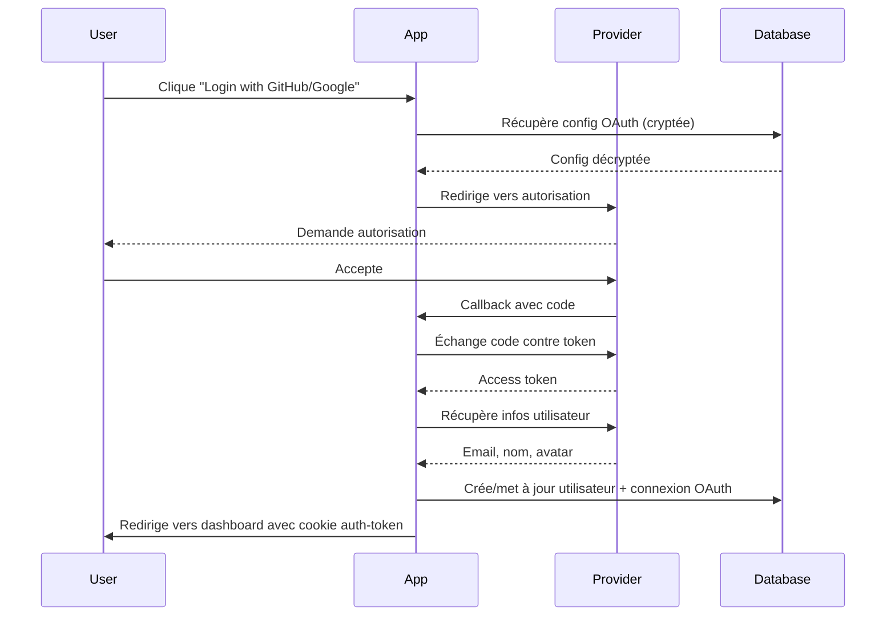

# Architecture OAuth Multi-Providers

**Date de création :** 23 janvier 2026  
**Statut :** ✅ Implémenté  
**Version :** 2.0

---

## 📋 Vue d'ensemble

Cette architecture fournit un système OAuth **modulaire et évolutif** permettant d'ajouter facilement de nouveaux providers d'authentification (Google, Facebook, Microsoft, etc.) sans dupliquer le code.

### Providers actuellement implémentés

| Provider | Statut | Fichier | Documentation |
|----------|--------|---------|---------------|
| **GitHub** | ✅ Production | `lib/oauth/providers/github.ts` | OAuth Apps GitHub |
| **Google** | 🟡 Prêt | `lib/oauth/providers/google.ts` | Google Cloud Console |
| Facebook | ⚪ À faire | - | - |
| Microsoft | ⚪ À faire | - | - |
| LinkedIn | ⚪ À faire | - | - |

---

## 🏗️ Architecture

### Structure des fichiers

```
lib/oauth/
├── types.ts                    # Types TypeScript communs
├── base-provider.ts            # Classe abstraite de base
├── helpers.ts                  # Fonctions utilitaires communes
├── index.ts                    # Registry des providers
├── providers/
│   ├── github.ts              # Implémentation GitHub
│   └── google.ts              # Implémentation Google
└── github-config.ts           # Legacy (à migrer)
```

### Flux d'authentification



---

## 🔑 Composants principaux

### 1. Types (`types.ts`)

Définit les interfaces TypeScript pour tous les providers :

- **`OAuthConfig`** - Configuration complète d'un provider
- **`OAuthProvider`** - Type union des providers supportés
- **`OAuthUserInfo`** - Informations utilisateur standardisées
- **`OAuthTokenResponse`** - Réponse d'échange de token

### 2. Base Provider (`base-provider.ts`)

Classe abstraite contenant la logique commune :

#### Responsabilités
- ✅ Récupération config depuis DB (décryptage automatique)
- ✅ Auto-détection du domaine (production vs localhost)
- ✅ Construction des URLs de callback
- ✅ Génération du state CSRF
- ✅ Validation des URLs

#### Méthodes abstraites
Chaque provider doit implémenter :
- `getAuthorizationUrl()` - Construit l'URL d'autorisation
- `getScopes()` - Retourne les scopes OAuth requis

### 3. Helpers (`helpers.ts`)

Fonctions utilitaires partagées :

#### `handleOAuthUser(oauthUserInfo, accessToken)`
Gère la logique complète de création/mise à jour utilisateur :
1. Vérifie si connexion OAuth existe
2. Si oui → Met à jour le token
3. Si non → Vérifie si utilisateur existe par email
4. Lie le compte OAuth ou crée un nouvel utilisateur
5. Récupère roles + permissions
6. Génère le JWT token complet

#### `verifyOAuthState(savedState, receivedState)`
Vérifie le state CSRF pour prévenir les attaques

#### `getOAuthStateCookieName(provider)`
Génère le nom du cookie de state (`github_oauth_state`, `google_oauth_state`, etc.)

### 4. Provider Registry (`index.ts`)

Point d'entrée centralisé :

```typescript
import { getOAuthProvider } from "@/lib/oauth";

// Récupérer un provider
const provider = getOAuthProvider('github');
const config = await provider.getConfiguration();

// Lister les providers disponibles
const available = getAvailableProviders(); // ['github', 'google']
```

---

## 🎯 Implémentation d'un provider

### Exemple : GitHub

```typescript
import { BaseOAuthProvider } from "../base-provider";

export class GitHubOAuthProvider extends BaseOAuthProvider {
  constructor() {
    super('github');
  }

  getScopes(): string[] {
    return ['user:email', 'read:user'];
  }

  getAuthorizationUrl(config: OAuthConfig, state: string): string {
    const url = new URL("https://github.com/login/oauth/authorize");
    url.searchParams.set("client_id", config.clientId);
    url.searchParams.set("redirect_uri", config.callbackUrl);
    url.searchParams.set("scope", this.getScopes().join(' '));
    url.searchParams.set("state", state);
    return url.toString();
  }

  async exchangeCodeForToken(code: string, config: OAuthConfig) {
    // Implémentation spécifique GitHub
  }

  async getUserInfo(accessToken: string) {
    // Implémentation spécifique GitHub
  }
}
```

---

## ⚙️ Configuration en base de données

### Table : `service_api_configs`

Chaque provider OAuth est stocké comme un service API :

```sql
INSERT INTO service_api_configs (
  service_name,      -- 'github', 'google', etc.
  service_type,      -- 'oauth'
  environment,       -- 'production', 'preview', 'development'
  config,           -- { clientId, clientSecret } (crypté AES-256-GCM)
  metadata,         -- { callbackUrl?, baseUrl?, scopes? }
  is_active         -- true/false
) VALUES (
  'github',
  'oauth',
  'production',
  '{"clientId": "Ov23...", "clientSecret": "..."}',
  '{"callbackUrl": "https://www.neosaas.tech/api/auth/oauth/github/callback"}',
  true
);
```

### Cryptage des credentials

- **Algorithme :** AES-256-GCM
- **Dérivation clé :** PBKDF2 (100,000 itérations)
- **Décryptage automatique :** Via `serviceApiRepository.getConfig()`

---

## 🔄 Routes API

### Structure des routes

```
app/api/auth/oauth/
├── config/
│   └── route.ts              # GET - Liste providers actifs
├── [provider]/
│   ├── route.ts              # GET - Initie OAuth
│   └── callback/
│       └── route.ts          # GET - Traite callback
```

### Exemple d'utilisation

#### 1. Récupérer les providers actifs

```typescript
// GET /api/auth/oauth/config
{
  "success": true,
  "providers": {
    "github": { "enabled": true },
    "google": { "enabled": true }
  },
  "github": true,
  "google": true
}
```

#### 2. Initier l'authentification

```typescript
// GET /api/auth/oauth/github
// → Redirige vers GitHub avec state CSRF
```

#### 3. Callback

```typescript
// GET /api/auth/oauth/github/callback?code=xxx&state=xxx
// → Échange code, crée utilisateur, redirige vers /dashboard
```

---

## 📊 Gestion du cache

### Configuration anti-cache

Pour éviter les problèmes de cache en production :

#### Routes API
```typescript
export const dynamic = 'force-dynamic';
export const revalidate = 0;
```

#### Headers globaux (`next.config.mjs`)
```javascript
{
  source: '/api/:path*',
  headers: [
    { key: 'Cache-Control', value: 'no-store, no-cache' },
    { key: 'Pragma', value: 'no-cache' },
    { key: 'Expires', value: '0' }
  ]
}
```

#### Fetch côté client
```typescript
fetch('/api/auth/oauth/config', {
  cache: 'no-store',
  headers: { 'Cache-Control': 'no-cache' }
})
```

---

## 🆕 Ajouter un nouveau provider

### Étape 1 : Créer le provider

Créer `lib/oauth/providers/facebook.ts` :

```typescript
import { BaseOAuthProvider } from "../base-provider";

export class FacebookOAuthProvider extends BaseOAuthProvider {
  constructor() {
    super('facebook');
  }

  getScopes(): string[] {
    return ['email', 'public_profile'];
  }

  getAuthorizationUrl(config: OAuthConfig, state: string): string {
    // Implémentation Facebook
  }

  async exchangeCodeForToken(code: string, config: OAuthConfig) {
    // Implémentation Facebook
  }

  async getUserInfo(accessToken: string) {
    // Implémentation Facebook
  }
}

export const facebookOAuthProvider = new FacebookOAuthProvider();
```

### Étape 2 : Enregistrer dans le registry

Modifier `lib/oauth/index.ts` :

```typescript
import { facebookOAuthProvider } from "./providers/facebook";

export const oauthProviders = {
  github: githubOAuthProvider,
  google: googleOAuthProvider,
  facebook: facebookOAuthProvider, // ✅ Ajouter ici
  // ...
};
```

### Étape 3 : Ajouter le type

Modifier `lib/oauth/types.ts` :

```typescript
export type OAuthProvider = 
  | 'github' 
  | 'google' 
  | 'facebook'  // ✅ Ajouter ici
  // ...
```

### Étape 4 : Créer les routes API

Copier la structure `app/api/auth/oauth/github/` vers `facebook/`

### Étape 5 : Configurer en DB

```sql
INSERT INTO service_api_configs (
  service_name, service_type, environment,
  config, metadata, is_active
) VALUES (
  'facebook', 'oauth', 'production',
  '{"clientId": "...", "clientSecret": "..."}',
  '{"callbackUrl": "https://www.neosaas.tech/api/auth/oauth/facebook/callback"}',
  true
);
```

### Étape 6 : Ajouter le bouton UI

Dans `app/auth/login/page.tsx` :

```tsx
{oauthConfig.facebook && (
  <Button onClick={() => window.location.href = '/api/auth/oauth/facebook'}>
    <FacebookIcon /> Continue with Facebook
  </Button>
)}
```

---

## 🔒 Sécurité

### Protection CSRF
- ✅ State généré aléatoirement (UUID)
- ✅ Stocké dans cookie HttpOnly
- ✅ Vérifié au callback

### Stockage des tokens
- ✅ Credentials cryptés AES-256-GCM en DB
- ✅ JWT token dans cookie HttpOnly
- ✅ SameSite=Lax pour protection CSRF

### Validation
- ✅ Vérification email obligatoire
- ✅ URLs de callback en liste blanche
- ✅ Timeout des states (cookies expirés)

---

## 📝 Logs et debugging

### Logs structurés

Chaque provider log les étapes importantes :

```
🔍 [OAuth github] Récupération de la configuration cryptée (env: production)
✅ [OAuth github] Configuration chargée avec succès
   - Client ID: Ov23licqdR...
   - Callback URL: https://www.neosaas.tech/api/auth/oauth/github/callback
   - Base URL: https://www.neosaas.tech
🌐 [OAuth github] Auto-détection base URL: https://www.neosaas.tech
✅ [OAuth github] Token JWT créé
   - User ID: cm4...
   - Email: user@example.com
   - Roles: admin
   - Permissions: 5 permissions
```

### En cas d'erreur

Les erreurs incluent des solutions actionnables :

```
❌ [OAuth google] Impossible de construire l'URL de callback
   - callbackPath: /api/auth/oauth/google/callback
   - baseUrl: 
   - NEXT_PUBLIC_APP_URL: NOT SET
   ⚠️  SOLUTION: Définir NEXT_PUBLIC_APP_URL
   Example: NEXT_PUBLIC_APP_URL=https://www.neosaas.tech
```

---

## 🧪 Tests

### Tester un nouveau provider

1. **Configuration en DB :**
   - Créer le service API dans `/admin/api`
   - Activer le provider
   - Configurer Client ID + Secret

2. **Test d'initiation :**
   ```bash
   curl https://www.neosaas.tech/api/auth/oauth/google
   # → Devrait rediriger vers Google
   ```

3. **Vérifier les logs :**
   - Check Vercel logs pour voir les étapes
   - Vérifier que le state est créé
   - Vérifier l'URL de redirection

4. **Test complet :**
   - Cliquer sur "Login with Google"
   - Autoriser l'app
   - Vérifier la redirection vers `/dashboard`
   - Vérifier le cookie `auth-token`

---

## 📚 Références

### Documentation externe
- [GitHub OAuth Apps](https://docs.github.com/en/apps/oauth-apps)
- [Google OAuth 2.0](https://developers.google.com/identity/protocols/oauth2)
- [Next.js API Routes](https://nextjs.org/docs/app/building-your-application/routing/route-handlers)

### Fichiers clés du projet
- `lib/auth.ts` - Fonctions d'authentification JWT
- `lib/auth/server.ts` - Vérification auth server-side
- `db/schema.ts` - Schéma `oauthConnections`
- `lib/services/service-api-repository.ts` - Cryptage/décryptage

---

## 🎨 Bonnes pratiques

### ✅ À faire
- Utiliser `BaseOAuthProvider` pour nouveaux providers
- Centraliser la logique dans `helpers.ts`
- Logger toutes les étapes importantes
- Valider les URLs de callback
- Tester en local puis en preview avant production

### ❌ À éviter
- Dupliquer le code entre providers
- Stocker des secrets en clair
- Ignorer la validation du state CSRF
- Hardcoder les URLs (utiliser auto-détection)
- Oublier d'ajouter `dynamic = 'force-dynamic'`

---

## 🚀 Roadmap

### Court terme
- [ ] Implémenter Facebook OAuth
- [ ] Implémenter Microsoft OAuth
- [ ] Tests automatisés pour chaque provider

### Moyen terme
- [ ] Support refresh tokens
- [ ] Gestion expiration tokens
- [ ] Révocation de connexions OAuth

### Long terme
- [ ] OAuth pour API mobile
- [ ] Support OpenID Connect
- [ ] Multi-tenant OAuth configs
