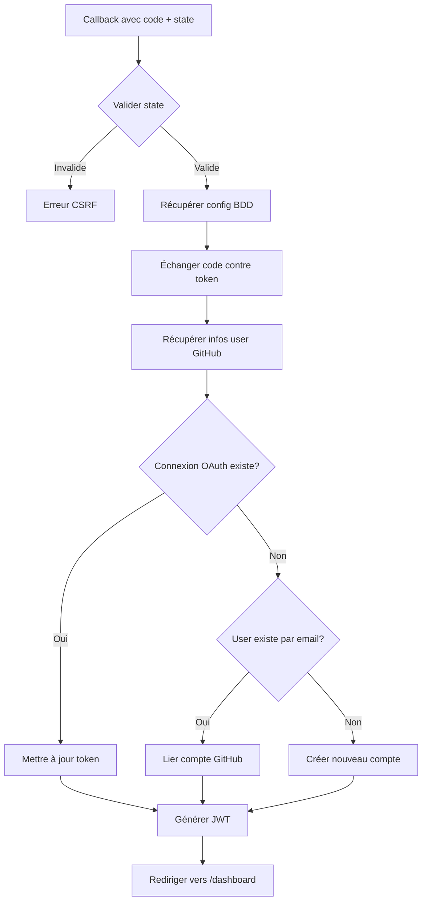

# OAuth Configuration via Base de Données

## 📋 Vue d'ensemble

Ce document explique comment NeoSaaS gère l'authentification OAuth **sans variables d'environnement**, en stockant tous les credentials dans la base de données.

### Avantages de cette approche

✅ **Configuration Admin** : Tout se fait via l'interface `/admin/api`  
✅ **Pas de redéploiement** : Changements immédiats sans rebuild  
✅ **Multi-environnements** : Production, preview, dev séparés  
✅ **Sécurité** : Credentials chiffrés en BDD (AES-256-GCM)  
✅ **Cohérence** : Même pattern que Stripe, PayPal, etc.

---

## 🏗️ Architecture

### Flux de données

```
┌─────────────────┐
│  Admin UI       │ 
│  /admin/api     │ 
└────────┬────────┘
         │ Configure OAuth
         ▼
┌─────────────────────────────┐
│  service_api_configs        │
│  ┌─────────────────────┐   │
│  │ serviceName: github │   │
│  │ config: {           │   │
│  │   clientId: "..."   │   │
│  │   clientSecret: "..." │ │ ◄── Chiffré AES-256-GCM
│  │ }                   │   │
│  │ metadata: {         │   │
│  │   callbackUrl       │   │
│  │   baseUrl           │   │
│  │ }                   │   │
│  └─────────────────────┘   │
└─────────────▲───────────────┘
              │
              │ getGitHubOAuthConfig()
              │
┌─────────────┴───────────────┐
│  OAuth Routes               │
│  ┌─────────────────────┐   │
│  │ /oauth/github       │   │ ◄── Initiation
│  │ /oauth/github/      │   │
│  │   callback          │   │ ◄── Callback
│  └─────────────────────┘   │
└─────────────┬───────────────┘
              │
              ▼
┌─────────────────────────────┐
│  GitHub                     │
│  api.github.com             │
└─────────────────────────────┘
```

---

## 🔧 Configuration Initiale

### Étape 1 : Créer l'OAuth App GitHub (Manuel)

> ⚠️ **Important** : L'API GitHub ne permet pas la création automatique d'OAuth Apps. Vous devez créer l'app manuellement via l'interface GitHub.

1. **Aller sur GitHub** :
   - **Compte personnel** : https://github.com/settings/developers
   - **Organisation** : `https://github.com/organizations/VOTRE_ORG/settings/applications`

2. **Créer une nouvelle OAuth App** :
   - Cliquer sur **"New OAuth App"**
   - Remplir le formulaire :
     - **Application name** : `NeoSaaS Production` (ou nom de votre choix)
     - **Homepage URL** : `https://votre-domaine.com`
     - **Authorization callback URL** : `https://votre-domaine.com/api/auth/oauth/github/callback`
   - Cliquer sur **"Register application"**

3. **Récupérer les credentials** :
   - **Client ID** : Visible immédiatement sur la page
   - **Client Secret** : Cliquer sur **"Generate a new client secret"**
   - ⚠️ **Sauvegarder le Client Secret** immédiatement (impossible à récupérer après)

### Étape 2 : Stocker en Base de Données

**Option A : Via l'Interface Admin `/admin/api`** (Recommandé)

1. Se connecter en tant qu'admin
2. Aller sur `/admin/api`
3. Chercher "GitHub OAuth" dans la liste des services
4. Entrer les credentials récupérés :
   - Client ID
   - Client Secret
5. Cliquer sur "Enregistrer"

**Option B : Via SQL Direct**
3. Coller le PAT dans le champ
4. Cliquer "Configurer automatiquement"

Le système va :
- ✅ Créer l'OAuth App sur GitHub
- ✅ Récupérer clientId et clientSecret
- ✅ Stocker en BDD avec chiffrement
- ✅ Configurer le callback URL

**Option B : Configuration Manuelle**

1. Créer manuellement une OAuth App sur GitHub :
   - Organisation : https://github.com/organizations/[ORG]/settings/applications
   - Ou Personnel : https://github.com/settings/developers

2. Paramètres :
   ```
   Application name: NeoSaaS OAuth
   Homepage URL: https://votre-domaine.com
   Callback URL: https://votre-domaine.com/api/auth/oauth/github/callback
   ```

3. Noter le Client ID et Client Secret

4. Dans `/admin/api` > "GitHub OAuth" :
   - Coller Client ID
   - Coller Client Secret
   - Le callback URL est auto-généré
   - Cliquer "Sauvegarder"

---

## 🔐 Sécurité

### Chiffrement des Credentials

Les `clientSecret` et `accessToken` sont **automatiquement chiffrés** en BDD via le schéma Drizzle :

```typescript
// db/schema.ts
export const serviceApiConfigs = pgTable("service_api_configs", {
  config: jsonb("config").notNull(), // ← Auto-chiffré (AES-256-GCM)
  // ...
})
```

### Protection CSRF

Le flux OAuth utilise un `state` aléatoire :

```typescript
// Génération
const state = crypto.randomUUID();

// Stockage sécurisé
response.cookies.set("github_oauth_state", state, {
  httpOnly: true,
  secure: true,
  sameSite: "lax",
  maxAge: 600, // 10 minutes
});

// Validation au callback
if (savedState !== receivedState) {
  throw new Error("Invalid state");
}
```

### Tokens JWT

Après authentification réussie :

```typescript
const token = await new SignJWT({ userId })
  .setProtectedHeader({ alg: "HS256" })
  .setExpirationTime("7d")
  .sign(secret);

response.cookies.set("token", token, {
  httpOnly: true,
  secure: true,
  sameSite: "lax",
  maxAge: 604800, // 7 jours
});
```

---

## 📡 API Routes

### 1. Helper Configuration

**Fichier** : `lib/oauth/github-config.ts`

```typescript
import { getGitHubOAuthConfig } from "@/lib/oauth/github-config";

// Récupérer la config OAuth depuis la BDD
const config = await getGitHubOAuthConfig("production");

if (config) {
  console.log(config.clientId);     // Depuis BDD
  console.log(config.clientSecret); // Depuis BDD (déchiffré)
  console.log(config.callbackUrl);  // Depuis metadata BDD
}
```

**Fonction principale** :

```typescript
async function getGitHubOAuthConfig(
  environment = "production"
): Promise<GitHubOAuthConfig | null>
```

**Retourne** :
```typescript
interface GitHubOAuthConfig {
  clientId: string;
  clientSecret: string;
  callbackUrl: string;
  baseUrl: string;
  isActive: boolean;
}
```

**Source des données** :
- `service_api_configs` table
- Filtré par : `serviceName = 'github'` + `environment` + `isActive = true`

### 2. Route d'Initiation

**Endpoint** : `GET /api/auth/oauth/github`

**Flux** :
1. Récupère config depuis BDD via `getGitHubOAuthConfig()`
2. Génère state CSRF
3. Redirige vers GitHub avec :
   ```
   https://github.com/login/oauth/authorize
     ?client_id=...        (depuis BDD)
     &redirect_uri=...     (depuis BDD metadata)
     &scope=read:user user:email
     &state=...            (UUID aléatoire)
   ```

**Utilisation** :

```html
<!-- Dans /auth/login -->
<a href="/api/auth/oauth/github">
  <button>Se connecter avec GitHub</button>
</a>
```

### 3. Route Callback

**Endpoint** : `GET /api/auth/oauth/github/callback`

**Paramètres attendus** :
- `code` : Code d'autorisation GitHub
- `state` : État CSRF à valider

**Flux complet** :



**Tables modifiées** :
- `users` : Création si nouveau
- `oauth_connections` : Création ou mise à jour

---

## 💾 Stockage BDD

### Table `service_api_configs`

```sql
INSERT INTO service_api_configs (
  service_name,
  service_type,
  environment,
  is_active,
  is_default,
  config,              -- ← Chiffré
  metadata
) VALUES (
  'github',
  'oauth',
  'production',
  true,
  true,
  '{"clientId": "Ov...", "clientSecret": "gho_..."}',  -- Chiffré
  '{"callbackUrl": "https://...", "baseUrl": "https://..."}'
);
```

### Table `oauth_connections`

Créée automatiquement au premier login :

```sql
INSERT INTO oauth_connections (
  user_id,
  provider,
  provider_user_id,
  email,
  access_token,        -- ← Chiffré
  metadata
) VALUES (
  '...',
  'github',
  '123456',
  'user@example.com',
  'gho_...',          -- Chiffré
  '{"login": "username", "avatar_url": "https://..."}'
);
```

---

## 🧪 Tests

### Test Manuel

1. **Vérifier la configuration** :
   ```bash
   # Dans psql ou DB viewer
   SELECT 
     service_name, 
     environment, 
     is_active,
     config,
     metadata
   FROM service_api_configs
   WHERE service_name = 'github';
   ```

2. **Tester le flux OAuth** :
   - Aller sur `/auth/login`
   - Cliquer "Se connecter avec GitHub"
   - Autoriser l'application sur GitHub
   - Vérifier redirection vers `/dashboard`

3. **Vérifier la connexion créée** :
   ```bash
   SELECT * FROM oauth_connections 
   WHERE provider = 'github' 
   ORDER BY created_at DESC 
   LIMIT 1;
   ```

### Logs de Debug

Activer les logs détaillés :

```typescript
// lib/oauth/github-config.ts
console.log("🔍 [GitHub OAuth] Récupération config...");
console.log("✅ [GitHub OAuth] Configuration chargée");

// app/api/auth/oauth/github/route.ts
console.log("🔐 [GitHub OAuth] Initiation...");
console.log("✅ [GitHub OAuth] Redirection vers GitHub");

// app/api/auth/oauth/github/callback/route.ts
console.log("🔄 [GitHub OAuth Callback] Réception callback");
console.log("✅ [GitHub OAuth Callback] Authentification réussie");
```

---

## 🚨 Troubleshooting

### Erreur : "Configuration non trouvée"

**Cause** : Aucune config active dans `service_api_configs`

**Solution** :
1. Aller sur `/admin/api`
2. Configurer GitHub OAuth
3. Vérifier `is_active = true` en BDD

### Erreur : "Invalid state"

**Cause** : Cookie de state expiré ou manquant

**Solution** :
- Réessayer le flux OAuth complet
- Vérifier que les cookies sont activés
- Vérifier le domaine du cookie (`sameSite: 'lax'`)

### Erreur : "Token exchange failed"

**Cause** : Credentials invalides ou callback URL incorrect

**Solution** :
1. Vérifier le `clientId` et `clientSecret` en BDD
2. Vérifier le `callbackUrl` correspond à celui de GitHub App
3. Vérifier que l'OAuth App GitHub est active

### Utilisateur créé mais pas de connexion

**Cause** : Erreur lors de l'insertion dans `oauth_connections`

**Solution** :
- Vérifier les logs serveur
- Vérifier la contrainte unique `[provider, provider_user_id]`
- Vérifier le schema `oauth_connections`

---

## 🔄 Migration depuis ENV variables

Si vous avez un ancien système avec ENV variables :

### Avant

```env
GITHUB_CLIENT_ID=Ov23...
GITHUB_CLIENT_SECRET=gho_...
GITHUB_CALLBACK_URL=https://...
```

### Migration

```typescript
// Script de migration (à exécuter une fois)
import { db } from "@/db";
import { serviceApiConfigs } from "@/db/schema";

await db.insert(serviceApiConfigs).values({
  serviceName: "github",
  serviceType: "oauth",
  environment: "production",
  isActive: true,
  isDefault: true,
  config: {
    clientId: process.env.GITHUB_CLIENT_ID!,
    clientSecret: process.env.GITHUB_CLIENT_SECRET!,
  },
  metadata: {
    callbackUrl: process.env.GITHUB_CALLBACK_URL!,
    baseUrl: process.env.NEXT_PUBLIC_APP_URL!,
  },
});
```

### Après

```env
# Plus besoin de ces variables ! 🎉
# GITHUB_CLIENT_ID=Ov23...
# GITHUB_CLIENT_SECRET=gho_...
# GITHUB_CALLBACK_URL=https://...
```

---

## 📚 Références

- [Schéma BDD OAuth](../db/schema.ts#oauth_connections)
- [Helper Configuration](../lib/oauth/github-config.ts)
- [Route Initiation](../app/api/auth/oauth/github/route.ts)
- [Route Callback](../app/api/auth/oauth/github/callback/route.ts)
- [Guide GitHub OAuth](https://docs.github.com/en/apps/oauth-apps/building-oauth-apps)

---

## ✨ Prochaines Étapes

1. **Google OAuth** : Implémenter le même pattern pour Google
2. **UI Admin** : Ajouter test de connexion dans `/admin/api`
3. **User Settings** : Permettre de lier/délier des comptes OAuth
4. **Multi-providers** : Lier plusieurs providers au même compte
